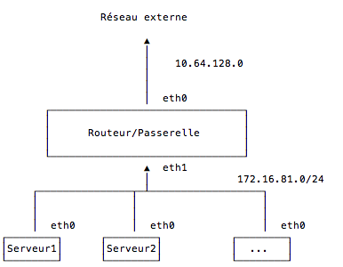

# Installation de serveur DNS et DHCP sous Debian

## Introduction
Ceci est une procédure permettant d'installer un serveur DHCP et DNS sur une machine Debian.

Son nom sera: `netgateway`.

Cette machine comportera :

* 256 Mo de RAM
* 3 Go de disque dur
* 2 cartes réseau montées sur deux `vmnet` différents
* aucune carte son, ni imprimante

## Configuration du réseau VMWare


Dans ce cas précis, on utilise une VM qui comporte deux cartes (et donc connectée à deux `vmnet` différents) :

* une dont le réseau est le réseau externe (eth0).
* une dont le réseau est 172.16.81.0/24 (eth1).

Ceci est à adapter aux besoins (c'est-à-dire au plan d'adressage que vous auriez mis en place).

**Vous devez impérativement gérer ces deux réseaux sur deux *vmnet* différents.**


### Avertissement

Toute configuration ne respectant pas ce qui précède risque de **provoquer des dysfonctionnements** sur le réseau local. Il est de votre responsabilité de configurer correctement vos cartes `vmnet`.


### Configuration spécifique pour une machine avec deux cartes réseau
Attention: il sera nécessaire de rajouter sur les clients (VM) les lignes suivantes si elles ont une seconde carte réseau:

```conf
allow-hotplug eth1
iface eth1 inet dhcp
```

### Carte réseau eth1
On édite `/etc/network/interfaces`

```conf
# The loopback network interface
auto lo
iface lo inet loopback

# The primary network interface
allow-hotplug eth0
iface eth0 inet dhcp

auto eth1
iface eth1 inet static
    address 172.16.81.2
    dns-nameservers 172.16.81.2
    network 172.16.81.0
    netmask 255.255.255.0
    broadcast 172.16.81.255

```

Pas de gateway (eth1 n'est pas la passerelle vers internet)

On redémarre:
```bash
sudo systemctl restart networking
```

## Installation des services

### Serveur DHCP

#### Installation
On installe isc-dhcp:
```bash
sudo apt-get install isc-dhcp-server
```
On fait une copie de sauvegarde du fichier de configuration:
```bash
sudo cp /etc/dhcp/dhcpd.conf /etc/dhcp/dhcpd.conf.bak
```

#### Interface réseau
Editer le fichier `/etc/default/isc-dhcp-server`

Modifier la valeur de INTERFACES:
```conf
INTERFACES="eth1"
```


#### Configuration des adresses

On édite ce fichier `/etc/dhcp/dhcpd.conf`:
```conf
ddns-update-style none;

# option definitions common to all supported networks...
option domain-name         "exemple.cesi";

option domain-name-servers 172.16.81.2;

default-lease-time 600;
max-lease-time 7200;

# If this DHCP server is the official DHCP server for the local
# network, the authoritative directive should be uncommented.
authoritative;

# Use this to send dhcp log messages to a different log file (you also
# have to hack syslog.conf to complete the redirection).
log-facility local7;

# No service will be given on this subnet, but declaring it helps the
# DHCP server to understand the network topology.
subnet 192.168.0.0 netmask 255.255.255.0 {
}

```

On ajoute le paragraphe suivant:
```conf
subnet 172.16.81.0 netmask 255.255.255.0 {
  authoritative;
  range                       172.16.81.13 172.16.81.50;
  option domain-name-servers  172.16.81.2 ;
  option domain-name          "exemple.cesi";
  option routers              172.16.81.2;
  default-lease-time          3600;
  max-lease-time              3600;
  option subnet-mask          255.255.255.0;
  option broadcast-address    172.16.81.255;

}

```

### Ajout d'un hôte
On ajoute le paragraphe suivant pour permettre à un hôte de se connecter et obtenir une adresse IP:
```conf
host debiantsr {
  hardware ethernet 00:0c:29:be:f9:93;
  fixed-address 172.16.81.11;
}
```

#### Redémarrage du serveur

Une fois le réseau redémarré et isc-dhcp configuré on peut le démarrer (ou redémarrer avec `restart`):

```bash
sudo systemctl start isc-dhcp-server
```

#### Affichage de la liste des réservations d'adresse

Le fichier `/var/lib/dhcp/dhcpd.leases` contient les réservations en cours:

```bash
less /var/lib/dhcp/dhcpd.leases
```

### Installation de BIND

#### Installation du paquet

```bash
sudo apt-get install bind9 bind9utils bind9-doc
```

#### Définition de la zone

Editer le fichier `/etc/bind/named.conf.local` et  ajouter ceci:


```conf
// Definition des zones
zone "exemple.cesi" {
        type master;
        file "/etc/bind/db.exemple.cesi";
};

// Definition des reverses
zone "81.16.172.in-addr.arpa" {
        type master;
        file "/etc/bind/db.81.16.172.in-addr.arpa";
};

```

#### Configuration de la zone

Edition du fichier `/etc/bind/db.exemple.cesi`

On fait correspondre ici un nom à une adresse IP. Ainsi, `trisquel.exemple.cesi` aura l'adresse `172.16.81.12`

```conf
$TTL    604800
@       IN      SOA     ns.exemple.cesi. admin.exemple.cesi. (17032304 604800 86400 2417200 604800)

@               IN      NS      ns.exemple.cesi.
ns              IN      A       172.16.81.2
netservice      IN      A       172.16.81.2


;serveur
debiansrv       IN      A       172.16.81.11
debsrv          IN      A       172.16.81.11
trisquel        IN      A       172.16.81.12

; Infrastructure
; LDAP
;llithyie        IN      A       172.16.81.150

; CAS SSO
;cerbere         IN      A       172.16.81.151

; Mail
;                IN      MX 10   hermes.exemple.cesi.
;hermes          IN      A       172.16.81.152
;smtp            IN      A       172.16.81.152
;pop3            IN      A       172.16.81.152
;mail            IN      A       172.16.81.152

```


#### Configuration du reverse

Edition du fichier `/etc/bind/db.81.16.172.in-addr.arpa`

Ici on fait correspondre l'IP au nom. Ainsi, à partir de l'adresse **12** (et donc 172.16.81.**12**) on obtient le nom de la machine sur le domaine `exemple.cesi` (ici `trisquel.exemple.cesi`)

```bash
$TTL 1800
@       IN      SOA     ns.exemple.cesi. admin.exemple.cesi. (3 14400 3600 604800 10800)

@       IN      NS      ns.
2       IN      PTR     ns.exemple.cesi.

11      IN      PTR     debiansrv.exemple.cesi.
12      IN      PTR     trisquel.exemple.cesi.                    

;150     IN      PTR     llithyie.exemple.cesi.
;151     IN      PTR     cerbere.exemple.cesi.
;152     IN      PTR     hermes.exemple.cesi.
;152     IN      PTR     smtp.exemple.cesi.
;152     IN      PTR     pop3.exemple.cesi.
;152     IN      PTR     mail.exemple.cesi.

```

#### Modification des options

Dans le fichier `/etc/bind/named.conf.options`

```conf
options {
        directory "/var/cache/bind";

        // If there is a firewall between you and nameservers you want
        // to talk to, you may need to fix the firewall to allow multiple
        // ports to talk.  See http://www.kb.cert.org/vuls/id/800113

        // If your ISP provided one or more IP addresses for stable
        // nameservers, you probably want to use them as forwarders.  
        // Uncomment the following block, and insert the addresses replacing
        // the all-0's placeholder.

        //allow-recursion { localhost; };
        allow-recursion { any; };

        forwarders { 8.8.8.8; };

        dnssec-enable no;
        dnssec-validation no;

        auth-nxdomain no;    # conform to RFC1035
        listen-on-v6 { any; };
        listen-on { any; };
        allow-query { any; };
};

```


#### Vérification
```bash
$ sudo named-checkconf
$ sudo named-checkzone exemple.cesi /etc/bind/db.exemple.cesi
zone exemple.com/IN: loaded serial 17032304
OK
$ sudo named-checkzone exemple.cesi /etc/bind/db.81.16.172.in-addr.arpa
zone exemple.com/IN: loaded serial 3
OK

```

#### Tests
On utilise la commande dig:

```bash
dig @172.16.81.2 debiansrv.exemple.cesi
```

#### Débuggage et recherche de pannes
##### Statut du service
```bash
sudo systemctl status bind9
```

#### Journaux
Les journaux permettent d'afficher les informations renvoyées par le serveur:

```bash
sudo journalctl -f -u bind9
```

Enlever `-f` pour un affichage normal (less).

`-f` permet d'avoir le même comportement que `tail -f`

### Autres outils associés
Voir cette page:
https://www.isc.org/community/tools/


## Mise en place de la passerelle réseau
### IP Forwarding
```bash
sudo ne /etc/sysctl.conf
```

On décommente les lignes suivantes
```conf
net.ipv4.ip_forward=1
# ...
net.ipv6.conf.all.forwarding=1
```

On met à jour le système par rapport à cette nouvelle configuration
```bash
sudo sysctl -p
```
Et on vérifie que l'on obtient 1 en appelant cette commande:
```bash
$ cat /proc/sys/net/ipv4/ip_forward
1
```

### Règles iptables
#### Définition
Afin de permettre à une machine se connectant à cette passerelle d'accéder à Internet, il faut ajouter la règle suivante:

```bash
sudo iptables -t nat -A POSTROUTING -o eth0 -j MASQUERADE
```

Cependant, cette règle sera perdue au prochain redémarrage de la machine.

#### Sauvegarde
Pour éviter cela, on va installer un paquet qui permet de sauvegarder la configuration iptables et de la restaurer automatiquement au démarrage.

```bash
sudo apt-get install iptables-persistent
```

Au moment de l'installation, l'installeur nous demande si nous souhaitons sauvegarder les règles. Ce qui est ici le cas.

#### Sauvegarde en cas de modification
Pour information, en cas de changement (par exemple une règle de NAT qui redirige le port 80):
```bash
    sudo iptables -t nat -A PREROUTING -p tcp --dport 80 -j REDIRECT --to-ports 8080
```

Il suffit de relancer la commande suivante pour sauvegarder à nouveaux les règles iptables:
```bash
    sudo dpkg-reconfigure -y iptables-persistent
```

#### Information complémentaire
Cette dernière commande (`dpkg-reconfigure`) est l'équivalent de l'exécution des commandes suivantes:

```bash
    iptables-save >/etc/iptables/rules.v4
    ip6tables-save >/etc/iptables/rules.v6
```

Au redémarrage, on a l'équivalent des commandes suivantes qui est exécuté par `iptables-persistent`

```bash
    iptables-restore < /etc/iptables/rules.v4
    ip6tables-restore < /etc/iptables/rules.v6
```


#### Effacement des règles iptables

Le script suivant permet de supprimer toutes les règles iptables:

```bash
#!/bin/sh
#
# delete all existing rules.
#
iptables -F
iptables -t nat -F
iptables -t mangle -F
iptables -X

```


### Tests

Vous devez tester que vos machines clientes se connectent à Internet.


## Interfaces graphiques pour Bind9

Client Web:

* http://askubuntu.com/questions/20315/looking-for-bind-web-interface
* http://www.facilemanager.com/modules/fmdns/
* https://github.com/jforman/binder

Client lourd:

* https://packages.debian.org/jessie/gadmin-bind


## Références
https://www.guillaume-leduc.fr/projet-configuration-simple-facile-et-fonctionnelle-dun-dns-avec-bind9.html

https://www.digitalocean.com/community/tutorials/how-to-configure-bind-as-a-private-network-dns-server-on-ubuntu-14-04

https://doc.ubuntu-fr.org/bind9


## Exportation de Markdown

[Export vers LaTeX](:projets:enseignement:supports:latex)
